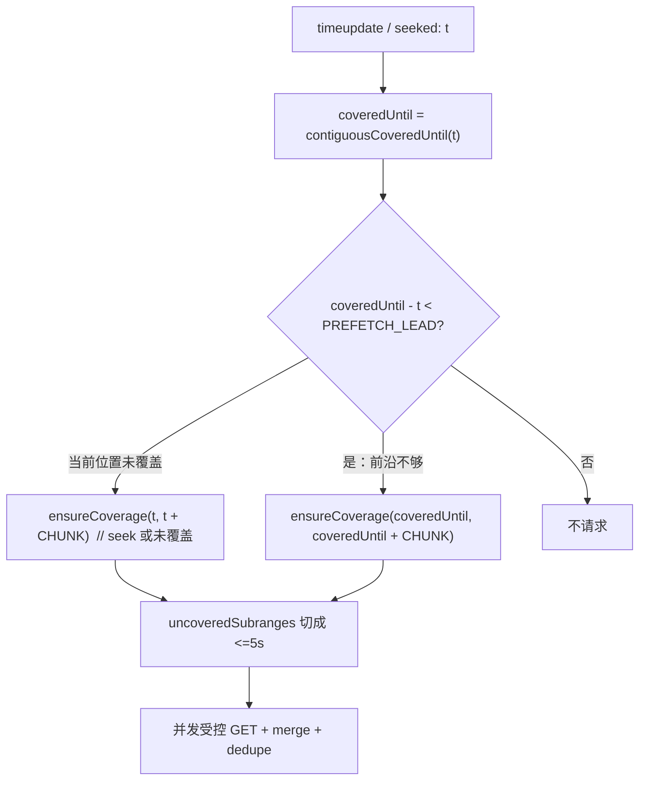

# 弹幕按时间轴增量加载算法

## 问题本质

后端单次只给左闭右开区间 `[fromMs, toMs)`，且 `toMs - fromMs ≤ 5000`。前端不能再全量拉，也不能用「固定从 0 对齐的 5s 格子」——你要求**跳转后以当前时间为锚点**开新窗。同时要避免重复请求已覆盖区间。

因此核心不是「段号表」，而是维护**已成功加载的时间覆盖集**。

## 推荐数据结构

抽一个独立模块，例如 [`nilo-project/src/pages/videoDetail/features/player/model/useDanmakuLoader.ts`](nilo-project/src/pages/videoDetail/features/player/model/useDanmakuLoader.ts)，由 [`usePlayer.ts`](nilo-project/src/pages/videoDetail/features/player/model/usePlayer.ts) 驱动。

| 结构 | 作用 |
|---|---|
| `loadedRanges: { from: number; to: number }[]` | 已覆盖区间，始终**按 from 排序、已合并、互不重叠** |
| `inflight: Map<string, Promise>` | key=`${from}-${to}`，防止同一缺口并发打两次 |
| `danmakuMap: Map<string, Danmaku>` | 以 `danmakuId` 去重；列表/插件都从这里导出 |
| 常量 | `CHUNK_MS=5000`，`PREFETCH_LEAD_MS=1500`（提前约 1.5s） |

右侧 [`DanmakuList`](nilo-project/src/pages/videoDetail/entities/danmakuList/ui/DanmakuList.vue) 继续读 `danmakuStore.danmakuList`，内容变为「已加载弹幕」（与播放器一致）；不做另套全量列表接口。

## 区间运算（算法核心）

半开区间 `[a,b)`。

1. **`mergeRange(from, to)`**  
   插入后与相邻/重叠区间合并。例：`[0,5k)+[5k,10k) → [0,10k)`。

2. **`contiguousCoveredUntil(t)`**  
   找包含 `t` 的已加载区间；有则返回其 `to`，否则返回 `t`（表示从当前位置起尚未覆盖）。  
   这决定「当前播放点前方连续覆盖到哪」。

3. **`uncoveredSubranges(from, to)`**  
   用 `desired - loaded` 做差，得到缺口列表；每个缺口再切成长度 ≤ 5000 的 chunk。  
   **只请求这些 chunk**，已覆盖部分绝不重打。

4. **`ensureCoverage(from, to)`**  
   `uncoveredSubranges` → 对每个 chunk：inflight 去重 → `GET` → `mergeRange` → 按 `danmakuId` 合入 map → 同步 store → 通知插件增量 `load`。

## 播放 / 跳转行为（对齐你的需求）

**起播或 seek 到 `t`（以当前时间为锚点）**

- 立刻 `ensureCoverage(t, t + 5000)`（`to` 不超过视频时长）。
- 例：跳到 `12.3s` → 拉 `[12300, 17300)`，而不是对齐到 `[10000, 15000)`。

**正常播放（提前 1~2s 预加载下一段）**

- 在 `video:timeupdate`（可 200~300ms throttle）里：
  - `coveredUntil = contiguousCoveredUntil(t)`
  - 若 `coveredUntil - t < 1500`，则再 `ensureCoverage(coveredUntil, coveredUntil + 5000)`
- 连续播放时分段会自然接成：`[12300,17300) → [17300,22300) → …`
- 若 seek 落在已覆盖区内且前方仍 ≥ 1.5s，**零请求**。

**跳进「空洞」**

- 例：已有 `[0,5000)` 与 `[10000,15000)`，seek 到 `7000`：
  - `contiguousCoveredUntil(7000)=7000` → 拉 `[7000,12000)`
  - 差集只会打未覆盖部分；与已有 `[10000,15000)` 重叠的尾部不会重复请求。

**换分 P / 换视频**

- 清空 `loadedRanges`、`inflight`、`danmakuMap`，插件 `reset`，再按新 `fileIndex` 从当前 `t` 重新锚点加载。

## API 与插件对接

[`VideoApi.loadDanmakuList`](nilo-project/src/pages/videoDetail/features/player/api/VideoApi.ts) 改为：

- path：与后端一致，使用 `/danmaku/{videoId}`（当前是 `/danmaku/danmaku/{videoId}`，需改）
- params：`fileIndex`、`fromMs`、`toMs`

[`usePlayer.ts`](nilo-project/src/pages/videoDetail/features/player/model/usePlayer.ts) 调整点：

- 去掉全量 `loadDanmakuList()` 作为 `danmuku` 初始源；改为空数组起步 + loader 驱动增量。
- 监听 `video:timeupdate` / `video:seeked`（或 art 等价事件）调用 loader。
- 新弹幕写入成功后：本地按 `danmakuId`（若有）或临时 id 插入 map，并 `ensureCoverage` 所在 5s 窗；不再 2s 后全量重拉。
- 插件侧沿用现有 `getDanmakuPlugin()?.load?.()`：每次合并新弹幕后把**全量已加载列表**再 `load` 一次（体量是「已看过的窗口」，可接受；避免纠结插件 append API）。

## 边界与并发

- `toMs` clamp 到 `durationMs`；最后不足 5s 的尾巴照常请求。
- 请求失败：不 `mergeRange`，允许下次 tick 重试；可选短 backoff。
- seek 很频繁：只保证「最新锚点」的 ensure；旧请求返回仍可 merge（当作缓存），不必强行 abort。
- `fromMs >= toMs` 直接跳过。

## 改动文件（实现阶段）

1. [`VideoApi.ts`](nilo-project/src/pages/videoDetail/features/player/api/VideoApi.ts) + [`Api.ts`](nilo-project/src/shared/config/Api.ts) — 区间参数与 path
2. 新建 `useDanmakuLoader.ts` — 区间集 + 预取 + 去重
3. [`usePlayer.ts`](nilo-project/src/pages/videoDetail/features/player/model/usePlayer.ts) — 接线 timeupdate/seeked、去掉全量加载
4. [`DanmakuStore.ts`](nilo-project/src/pages/videoDetail/features/player/store/DanmakuStore.ts) — 增加 `appendDanmaku` / `reset`（可选，或继续 `setDanmakuList`）

## 为何不用「全局固定 5s 格子」

固定格子实现简单，但与「跳转以当前时间为锚点」冲突，且 seek 到格子中间时要么多拉无用前半段，要么还要再算缺口——最终仍会落到区间差集。直接用覆盖集 + 锚点 chunk，语义更贴你的描述，代码路径也更少。
